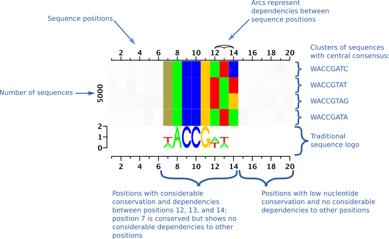

```{r setup, include = FALSE}
knitr::opts_chunk$set(
  collapse = TRUE,
  comment = "#>"
)
library(DepLogo)
```

We present dependency logos as a new way of visualizing dependency structures in aligned sequences. In contrast to traditional sequence logos [@Schneider90], dependency logos make dependencies between sequence positions visually perceptible. In contrast to previous approaches, dependency logos are model-free and only require a set of aligned sequences, e.g. predicted binding sites, and, optionally, associated weights as input.

```{r, fig.show='hold',echo=FALSE,fig.width=4,fig.height=5,fig.cap="*Original dependency logo (left) and showcase example of several new features of the DepLogo R-package (right).*"}

seqs <- read.table(system.file("extdata", "cjun.txt", package = "DepLogo"), stringsAsFactors = FALSE)
data <- DLData(sequences = seqs[, 1], weights = log1p(seqs[, 2]) )


plotDeplogo(data = data, dep.fun.legend = FALSE)
plotDeplogo(data = data, dep.fun = plotDepmatrix, weight.fun = subBoxes)

```


The DepLogo R-package extends the original dependency logos [@keilwagen15varying] in several aspects including

- a modular design of the different components of dependency logos,
- an alternative, matrix-like representation of dependencies between positions,
- alternative visualization of sub-sets of sequences including color charts and sequence logos,
- easy and flexible customization of resulting plots, including colors, different thresholds,...,
- extension to almost arbitrary alphabets, including RNA and protein alphabet, and gaps, and
- visualization of numeric values ("weights") associated with the individual sequences, e.g., prediction scores, peak statistics, binding affinities, etc.

The source code of the DepLogo R-package is available from https://github.com/Jstacs/DepLogo.

## General concepts of dependency logos

The general, conceptual idea of dependency logos is to show dependencies in (aligned) sequences by position-wise partitioning of input sequences. Each of the resulting partitions is then visualized separately. In case of inter-dependent positions, the symbols occurring at one position should be related to those symbols occurring at mutually dependent positions. Hence, a partitioning by symbols at the first position should also lead to a (partial) separation of symbols at those positions depending on the first position. Partitioning and subsequent visualization will make such dependencies perceptible. Each resulting partition may be sub-divided into further sub-groups recursively.

```{r ann, echo=FALSE, fig.cap="*Annotated version of a dependency logo.*", out.width=700}
knitr:::
```


Above, we show a dependency logo with annotations explaining the different parts. At the top of the plot, we find an axis with arcs connecting dependent positions. In this case, positions 12, 13, and 14 show a similar level of pairwise dependencies, whereas the other positions show no dependencies. In general, the levels of dependencies might be more gradual, from no dependencies to strong dependencies.

In the central part of the plot, we see colored boxes representing different partitions of the data. The central consensus sequences of the individual partitions are annotated on the right. Symbols are represented by colors in a similar manner as in traditional sequence logos, and the sequence logo at the lower part of the plot helps to recognize the mapping between colors and symbols (in this case DNA nucleotides).

Although the dependency logo spans 20 positions, only the central positions 7 to 14 are clearly colored. The reason is that colors assigned to the partitions at different positions are first mixed, depending on the symbols occurring in that partition at that position (e.g., position 7 is a mix of red (T) and green (A)), and then opacity is assigned based on "information content". This means that, in the same manner as in traditional sequence logos where positions which are close to a uniform distribution are scaled down, color intensity is scaled down at such positions (and partitions) in dependency logos.
Based on the dependency logo, we may state the following dependencies for these data:

- if position 14 is either "C" or "A" then position 12 is "A" and position 13 is "T",
- if position 14 is either "T" or "G" then position 12 is "T" and position 13 is "A",
- if position 12 is "A" then position 13 is "T", and vice versa.

In addition, we may state that although positions 7, 12 and 13 are all either "A" or "T", only positions 12 and 13 show dependencies to other positions, whereas the occurrence of "A" or "T" at positions 7 is independent of all other positions. Otherwise, we would i) find an arc between position 7 and other positions at the top of the plot and ii) position 7 would be de-mixed due to the partitioning at one of the other positions.
We may make a similar statement for position 14, which shows dependencies to positions 12 and 13, although its mon-nucleotide distribution over all sequences is uniform. By contrast, the remaining positions (1 to 6 and 15 to 20) are also uniformly distributed but mutually independent of all other positions. Notably, we cannot distinguish position 14 and the remaining positions (1 to 6 and 15 to 20) by means of the traditional sequence logo.

At the left of the central part, we further find the number of sequences that the dependency logo is based on.


Below, we show a series of (rather simple) dependency logos showing different levels and types of dependencies. Notably, the sequence logos of the first two data sets, and the sequence logos of the third and fourth data set look identical, although their dependency structures differ fundamentally. In the first data set, there are no dependencies between any positions, whereas in the second data set, positions 12 and 13 are mutually dependent. In the third data set, we find string dependencies between positions 12, 13, and 14, whereas in the fourth plot, positions 12 and 13 are independent but positions 13, 14, and 7 are mutually dependent.

```{r, fig.show='hold',echo=FALSE,fig.width=4,fig.height=3}

seqs <- scan(system.file("extdata", "pwm_bak.txt", package = "DepLogo"), what="character", comment.char = ">")
data <- DLData(seqs)
plotDeplogo(data)

seqs <- scan(system.file("extdata", "wam2_bak.txt", package = "DepLogo"), what="character", comment.char = ">")
data <- DLData(seqs)
plotDeplogo(data)

seqs <- scan(system.file("extdata", "wam_bak.txt", package = "DepLogo"), what="character", comment.char = ">")
data <- DLData(seqs)
plotDeplogo(data)

seqs <- scan(system.file("extdata", "long_bak.txt", package = "DepLogo"), what="character", comment.char = ">")
data <- DLData(seqs)
plotDeplogo(data)
```


Even if we plot the last data set as a color chart (below) instead of a sequence logo, it is almost impossible to perceive its dependency structure, for instance, the dependency of position 13 and position 7 as opposed to the independence of positions 12 and 13.

```{r,echo=FALSE,fig.width=4,fig.height=4}
plotBlocks(data, show.number = FALSE, block.fun = colorchart)
axis(1)
```

## Dependencies and p-values

In DepLogo, we compute the dependency values between positions as the mutual information between the respective symbol distributions, i.e,

$$
I(X,Y) = \sum_{a \in A} \sum_{b \in A} P(X=a,Y=b) \log \frac{P(X=a,Y=b)}{P(X=a)P(Y=b)},
$$
where $a$ and $b$ are symbols from the alphabet $A$, $P(X,Y)$ denotes the joint probability distribution of positions (random variables) $X$ and $Y$, and $P(X)$ and $P(Y)$ are the corresponding marginal distributions.

We know that $2N\cdot I(X,Y)$ is chi-squared distributed with $(|A|-1)^2$ degrees of freedom [@kullback1959information] (p. 158), i.e.,

$$
2N \cdot I(X,Y) \sim \chi^2((|A|-1)^2),
$$
where $N$ is the sample size (number of sequences), and $|A|$ denotes the size of the alphabet.
So, given a mutual information value $I$ computed for a pair of positions, we may compute the corresponding p-value as


```{r,eval=FALSE}
pchisq(I, df = (length(alphabet) - 1)^2, lower.tail = FALSE)
```

For mapping p-values to colors, we use a logarithmic scaling, i.e., we $-\log_{10}$ transform the resulting p-values.

## Plotting dependency logos from data

In the following, we show how to plot dependency logos from data. As an example data set, we consider binding sites of the human transcription factor *c-Jun* predicted in ChIP-seq positive peaks.

First, we load the data, which are stored in a tabular file containing the sequences in the first column and the peak statistics of the corresponding ChIP-seq peaks in the second column:

```{r}
seqs <- read.table(system.file("extdata", "cjun.txt", package = "DepLogo"), stringsAsFactors = FALSE)
head(seqs)
```

Before plotting dependency logos, we need to construct a *DLData* object from our data. A *DLData* object is a wrapper for the sequences (internally represented as a *data.frame* with sequences already split into their symbols), optional weights (here, the peak statistics), and the annotation of the underlying alphabet and corresponding colors for visualization. The default alphabet is the DNA alphabet. We may call the *DLData* constructor just with sequences and weights, in this case. The default delimiter between symbols is the empty string (splitting sequences into individual symbols), but may be changed to other values.

```{r}
data <- DLData(sequences = seqs[, 1],weights = log1p(seqs[, 2]) )
```
The implementation of *summary* for *DLData* objects returns a list containing the number of sequences, the consensus of all sequences, and the number of sequences that are identical to the consensus sequence.

We then use the resulting *DLData* object to plot a first dependency logo:

```{r}

plotDeplogo(data = data)

```

By default, dependencies between sequence positions are represented by shaded arcs. The intensity of an arc is chosen based on the mutual information between the two connected positions.
Partitions of the input sequence set are represented by position-wise, colored rectangles. This is basically the same kind of visualization that we also used in the introductory part of this vignette.

Instead of mutual information values, we may also use the corresponding p-values (see above):
```{r}
plotDeplogo(data = data, show.dependency.pvals = TRUE)
```

The default arc representations applies a cutoff on the mutual information values prior to visualization.

If we want to illustrate all pairwise dependency values, we may use a matrix of dependency values, instead:
```{r}
plotDeplogo(data = data, dep.fun = plotDepmatrix, show.dependency.pvals = TRUE)
```

In general, all major parts of the dependency logo (visualization of dependency strength at the top, visualization of the dependency structure in the middle, and summary of all the sequences at the bottom) may be customized. For this purpose, you can either use one of the pre-defined functions (see package documentation) or you can implement your own plotting functions as described below.

In the first of the following examples, we explicitly assign the default values to each of the plotting parameters, while in the second example, we visualize dependency structures by color charts, instead.
```{r}

plotDeplogo(data = data, dep.fun = plotDepmatrix, block.fun = deprects, summary.fun = logo)

plotDeplogo(data = data, dep.fun = plotDepmatrix, block.fun = colorchart, summary.fun = logo)

```

In some cases, it might also be reasonable to plot a dependency logo of the reverse complementary sequences. For this purpose, we provide a function *revcom* accepting a *DLData* object and returning a *DLData* object containing the reverse complementary sequences. The *revcom* function works only on *DLData* objects defined on DNA or RNA alphabets, which may include gaps. Providing *DLData* objects defined on other alphabets, the function call will result in an error.

```{r,fig.show='hold',fig.width=4,fig.height=5}
data.rc <- revcom(data)

plotDeplogo(data)
plotDeplogo(data.rc)
```

### Tuning parameters

The partitioning of the data and, consequently, the visualization by dependency logos, is influenced by different parameters of the *plotDeplogo* call. Specifically,

- *threshold* defines the threshold on the mutual information values. Positions with (average) mutual information values above this value are considered for partitioning the data by the symbols at these positions.
- *minPercent* defines the minimum size of a partition as the fraction of the full set of sequences assigned to its own partition.
- *maxNum* defines the maximum number of recursive splits.

While the default parameters of *plotDeplogo* will yield an acceptable result on most cases, specific data sets and applications may require some tuning to achieve a visually pleasing result.

The gradient of resulting dependency logos may span from *cluttered* to *overly aggregated* as illustrated in the examples below.

```{r}
plotDeplogo(data = data, threshold = 0.01, minPercent = 0.01, maxNum = 8)
```

```{r}
plotDeplogo(data = data, threshold = 0.04)
```


```{r}
plotDeplogo(data = data)
```

```{r}
plotDeplogo(data = data, threshold = 1.0)
```

In the first dependency logo, partitioning yields very small, highly specific partitions, which also include spurious dependencies.
The second and third dependency logos may be acceptable, depending on the application.
The fourth dependency logo does not partition the data at all and, hence, does not add any information compared with a traditional sequence logo.

### Alphabets beyond DNA

While dependency logos originally have been designed for visualizing dependencies in DNA sequences (i.e., transcription factor binding sites), their implementation in the DepLogo package also allows for using other alphabets, for instance, RNA nucleotides or amino acids in protein sequences, and handles gap symbols (-). However, only upper-case letters are supported.

Below, we show an example of a dependency logo of protein sequences, specifically sequences of the glycosyl transferase family as downloaded from PFAM (Accession PF02885.16). For proteins, we first define the amino acid alphabet and assign colors to each of the symbols (amino acids).
```{r}

prot <- c("I", "L", "V", "F", "M", "C", "A", "G", "P", "T", "S", "Y", "W", "Q", "N", "H", "E", "D", "K", "R", "B", "Z", "X","-")
colors <- rainbow(length(prot))
```

A pre-defined alphabet is also available in the variable *alphabet.protein.gap*:

```{r}
alphabet.protein.gap
```

We then load protein sequences from the file obtained from PFAM

```{r}
dat <- read.table(system.file("extdata", "Glycos_trans_3N.ann", package = "DepLogo"), stringsAsFactors = FALSE, fill = TRUE)
dat <- dat[-nrow(dat), 2]
dat <- toupper(gsub(pattern = "\\.", "-", dat))
```
which are slightly processed (all symbols converted to upper case, dots replaced by dashes) to be suitable for the *DLData* constructor.

We then create a *DLData* object from those sequences, specifying the custom alphabet and the corresponding colors:
```{r}
data <- DLData(sequences = dat, symbols = prot, colors = colors)
```

The alignment loaded from PFAM contains a large number of columns (positions)
```{r}
dim(data)
```
which are too many to be visualized by dependency logos. However, many of these positions mostly contain gap symbols, which might be less interesting for a visualization.

For this purpose, the DepLogo package contains a function *filterColumns* that removes all columns based on a user-supplied filter function. Here, we filter positions with a user-defined fraction of gap symbols from the alignment. This function results in a filtered *DLData* object. The resulting data have an acceptable number of columns and may be processed by *plotDeplogo*:
```{r}
fun <- filter.by.gaps(0.1)
dat2 <- filterColumns(data = data, filter.fun = fun)
dim(dat2)
```

In addition, the DepLogo package contains another function *suggestColors* that proposes distinguishable colors for each of the symbols. The idea is to chose different colors for symbols i) often occurring at the same position, especially ii) at those positions with the largest dependencies to other positions. The suggested colors may then be set for a *DLData* object using the *replaceColors* function:
```{r}
data2 <- replaceColors(dat2, suggestColors(dat2))
```

We may then plot a dependency logo for the modified *DLData* object:
```{r}
plotDeplogo(data2, threshold = 0.6)
```

Although colors have been chosen to be distinguishable, it may still be hard to recognize the individual symbols in the mixed colors of the dependency logo for large alphabets. In such cases, it may be useful to replace the standard, compact visualization of partitions by traditional, partition-wise sequence logos as in the following example.
```{r}
plotDeplogo(data2, threshold = 0.6, block.fun = logo)
```


## Adding plots of sequence weights/values

For many biological sequences, we may also obtain values associated with individual sequences in the data set. For instance, this may be peak statistics or binding affinities in case of transcription factor binding sites, or enzyme efficiencies in case of protein sequences.

Such values may be visualized for the partitions shown in a dependency logo in different ways. In the following example, we again consider the *c-Jun* binding sites together with the corresponding ChIP-seq peak statistics:
```{r}
seqs <- read.table(system.file("extdata", "cjun.txt", package = "DepLogo"), stringsAsFactors = FALSE)
data <- DLData(sequences = seqs[, 1], weights = log1p(seqs[, 2]) )
```

Here, the weights in each of the partitions generated by *plotDeplogo* are represented by boxplots:
```{r}
plotDeplogo(data = data, weight.fun = subBoxes)
```

In this case, the different partitions show similar distributions of the associated weights and, hence, may be considered as similarly functional binding sites.

In the same manner, we may consider binding sites of *Nrsf/REST*:
```{r}
seqs <- read.table(system.file("extdata", "nrsf.txt", package = "DepLogo"), stringsAsFactors = FALSE)
data <- DLData(sequences = seqs[,1], weights = log1p(seqs[,2]) )

plotDeplogo(data = data, threshold = 0.03, weight.fun = subBoxes)
```

Alternatively, weights may represented by line plots indicating the median value by a red vertical line:
```{r}
plotDeplogo(data = data, threshold = 0.03, weight.fun = subLines)
```

Here, we find that binding sites showing a larger number of conserved positions (as shown at the top of the central part of the dependency logo) show substantially larger weights (peak statistics) than the remaining binding sites.

In some cases, it might even be beneficial to first partition the data by sequence weights (e.g., high-scoring, mid-scoring, low-scoring) and plot individual representations of the symbol-based sub-partitions.
In this example, we create individual plots for the top 1000 binding sites, the following 2000 binding sites, and all remaining binding sites. We also assign different heights to each of these sub-plots.
```{r,fig.width=6,fig.height=8}
plotDeplogo(data = data, weight.fun = subBoxes, chunks = c(1000, 2000, length(data) - 3000), chunk.height = c(200, 200, 700))
```

The resulting dependency logo makes the relationship between sequence conservation and peak statistics even more obvious. However, the picture is also slightly cluttered, which may be adjusted for by tuning the partitioning parameters as described above.

## Components of dependency logos and customization

The building blocks of dependency logos may also be used separately, for instance in other, custom plots.
In the following, we show some examples of these building blocks and comment on the possibility of custom visualizations that may be plugged into *plotDeplogo*.

### Visualizing pairwise dependencies

Using the functions *plotDeparcs* and *plotDepmatrix*, only the pairwise dependencies (without the actual dependency structure on the sequence level) may be visualized. These functions also work on *DLData* objects and their use is demonstrated in the following examples:

```{r}
seqs <- read.table(system.file("extdata", "cjun.txt", package = "DepLogo"), stringsAsFactors = FALSE)
data <- DLData(sequences = seqs[, 1] )

plotDeparcs(data)
plotDepmatrix(data)
```

Again, these functions have further parameters that allow for some level of customization. For instance, the axis may be shown at the top of the plot (mirroring the corresponding plot at the x-axis), and p-values instead of mutual information values may be shown:
```{r}
plotDepmatrix(data, axis.at.bottom = FALSE, show.pvals = TRUE)
```

Implementations of custom functions for visualizing dependency values may also be plugged into the *plotDeplogo* function. The only requirement is to have the same signature as the existing implementations *plotDeparcs* and *plotDepmatrix*.

### Visualizing partitions of sequence data

We may also use the visualization of the partitioning of sequences independently of the *plotDeplogo* method.

For this purpose, we may first partition the data by the *partition* function, which is also used internally by *plotDeplogo* and, again, has several parameters influencing the partitioning result (see documentation):
```{r}

seqs <- read.table(system.file("extdata", "cjun.txt", package = "DepLogo"), stringsAsFactors = FALSE)
data <- DLData(sequences = seqs[, 1], weights = log1p( seqs[, 2] ) )

partitions <- partition(data, threshold = 0.3, minElements = 100)
```
Calling *summary* on this list of partitions returns a *data.frame* with columns for the total number of sequence, the consensus sequence, and the number of sequences that are identical to the consensus sequence, and with one row per partition.

The resulting partitioning may then be visualized by the default method of dependency logos, by color charts, or by separate sequence logos:
```{r}
plotBlocks(data = partitions)

plotBlocks(data = partitions, block.fun = colorchart)

plotBlocks(data = partitions, block.fun = logo)

```

The user may also chose to switch off the scaling by "information content",
```{r}
plotBlocks(data = partitions, ic.scale = FALSE)
```

which results in brown-ish colors at less conserved positions in the dependency logo visualization.

Again, the low-level plotting function *deprects*, *colorchart*, and *logo* may be replaced by custom implementation in both, *plotBlocks* and *plotDeplogo*. Here, the functions need to have the same signature as the current implementations and, in addition, return the vertical (y) offset after plotting the current partition. Further, the total height of visualizations of all partitions must have a height that is equal to the total number of sequences in the union of all these partitions because of the corresponding *ylim* specification in the high-level plot created by *plotBlocks*.

### Visualizing summaries of sequence data

For the summary visualization of the complete data set (parameter *summary.fun*), *plotDeplogo* internally also uses the *plotBlocks* function but with a single *DLData* object. Hence, the summary visualization may be customized in the same manner as the visualization of partitions explained above.

## References